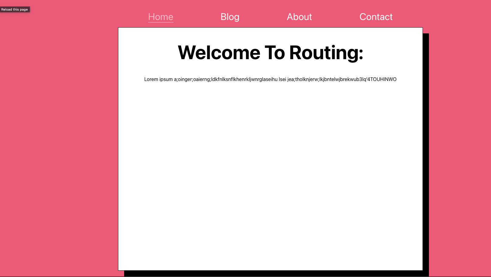

# CoderGirl-Frontend_Studio-Class-15

This studio is based off section 20 of your Udemy course - Multi-Page SPA with React Router. 
For now we'll stick with the essentials to build your routes and display your Single Page Application.

Tonight you'll be building out a small blog. And customizing the links using React Router. 

## Getting Started

### A. Fork & clone the repository from GitHub.

- [ ] Navigate to the [codergirl-frontend-class16-studio project repository]().
- [ ] Fork the repository to your own account, then grab the link from the green Code dropdown.
- [ ] In your terminal, go to the folder where you want your project to be. Use git clone to create your local copy.

### B. Get the project ready to code.
- [ ] In VSCode (or the IDE of your choice), open the project so you can view the code. You should already be in the main branch, which is where the starter code resides.
- [ ] Open a terminal inside your VSCode. Your terminal should already be inside the CoderGirl-FrontEnd_Studio6 directory. Then use the command npm install to download any required dependencies. 
- [ ] Now use the command npm start to serve the project to your browser. You should see a pink background.

## Part 1 - Forming the Routes
- [ ] Remember to Wrap the App component in a BrowserRouter component
- [ ] Let's start coding in App.js. First Render the following components in your JSX: <About/>, <Blog/>, <Contact/>, <Welcome/>. What do you see? 
- [ ]Import React Router and refactor the rendered components as routes with only a path attribute. Use the 'Welcome' component as your home or root page at '/'. 
- [ ] Next, let's refine the component further. Since the path checks for a string starting with '/', all of our pages are being displayed at once. What two things can implement to separate exact paths for each Route? Try it out! 
- [ ] Use the live server's URL to check each component. You should now see each component with its own unique text. 

## Part 2 - Adding NavLinks
- [ ] Let's add NavLinks to our app so were not toggling back and forth with the URL bar and can click instead. Insert a <nav> tag with a className of 'App-nav' inside the JSX above the routes. (The CSS for this class has been provided).
- [ ] Your Welcome Component will be called 'Home' in your link. Your Blog Component will be called 'Blog'. So on and so forth. Check the live server. Your links should be above the white box. Click between the links.
- [ ] So we see the links contain their respective component's information. but let's see if we can add more styling to the links. When a specific link is active, we want to see the text for that link change. Add the attribute activeClassName to your NavLinks and set it to 'active-link'.
- [ ] In App.css, make a class called '.active-link' where the color will change to pink, and the bottom border is changed to 1px solid white. Experiment with different styles if you don't like pink or a solid white border!
- [ ] When you're done, check your live server to see what happens. 

## Part 3 - BONUS MISSION: More Styling & Profiling with props.children and the render component 
- [ ] The Message component in your code is to wrap the content on each page with a border and font. Wrap all the 
 in your code with a Message component. When you render your components on the live server, what do you see? 
- [ ] What can we replace the paragraph in the Message component with to keep the properties of all the other component's content? 
- [ ] How can you display your name on the Home Page after "Welcome to Routing"? * Hint: [Use the link to learn little more on render props :](https://stackoverflow.com/questions/48150567/react-router-difference-between-component-and-render) CTRL+F or CMD+F and search the Key words "render prop" and make sure changes in the App.js*
- [ ] This is your sandbox, create, delete components, content and stylings here for more practice! 